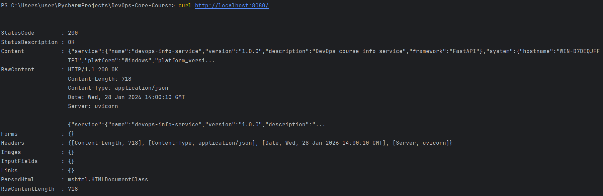
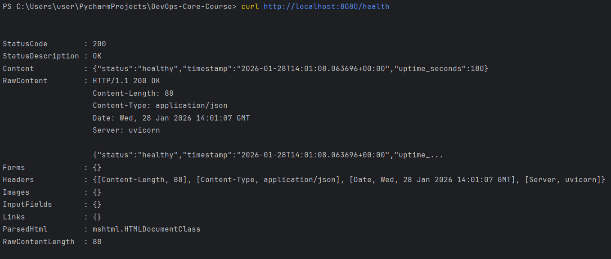
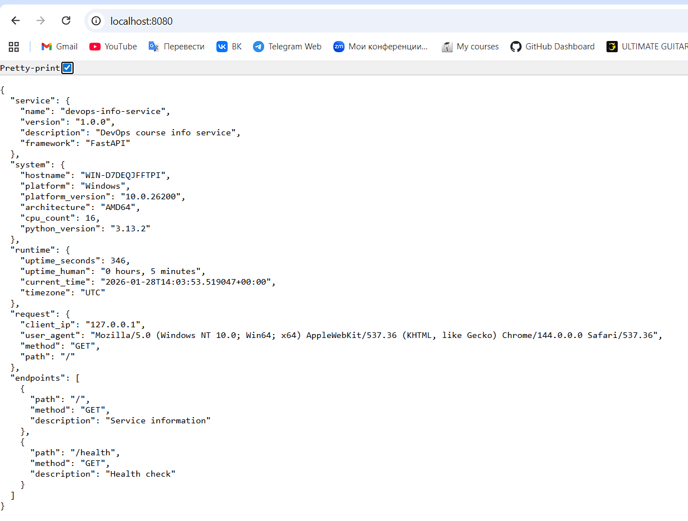

# LAB01 — DevOps Info Service (FastAPI)

## 1. Framework Selection

### Chosen Framework: **FastAPI**

For this lab, **FastAPI** was selected as the web framework for implementing the DevOps Info Service.

### Reasons for Choosing FastAPI

FastAPI was chosen because it is a modern, high-performance Python web framework that is well-suited for building APIs and production-ready services.

Key reasons:

* **High performance** due to ASGI and async support
* **Automatic API documentation** (OpenAPI / Swagger UI)
* **Type hints and validation** using Pydantic
* Clean and readable code structure
* Widely adopted in modern DevOps and cloud-native projects

### Framework Comparison

| Framework   | Pros                           | Cons                             |
| ----------- | ------------------------------ | -------------------------------- |
| **FastAPI** | Async, fast, auto-docs, modern | Slightly steeper learning curve  |
| Flask       | Very simple, flexible          | No async by default, manual docs |
| Django      | Full-featured, ORM included    | Heavyweight for small services   |

**Conclusion:** FastAPI provides the best balance between performance, clarity, and scalability for a DevOps-oriented service.

---

## 2. Best Practices Applied

### 2.1 Clean Code Organization

The application follows Python best practices:

* Clear and descriptive function names
* Logical separation of concerns
* Grouped imports
* PEP 8 compliant formatting
* Minimal but meaningful comments

**Examples:**

Comments:
```python
# Logging
logging.basicConfig(level=logging.INFO)
logger = logging.getLogger(__name__)
```
Clear function names
```python
def get_uptime()
```

---

### 2.2 Configuration via Environment Variables

The service is configurable using environment variables:

* `HOST` — server bind address
* `PORT` — application port

---

### 2.3 Logging

Structured logging is enabled using Python’s `logging` module.

* Logs application startup
* Logs incoming requests
* Uses timestamped log format

**Importance:**

* Essential for debugging
* Required for observability in production
* Integrates easily with log aggregation systems

---

## 3. API Documentation

### 3.1 Main Endpoint — `GET /`

Returns full service, system, runtime, and request information.

**Example request:**

```bash
curl http://localhost:8080/
```

**Example response (shortened):**

```json
{
  "service": {
    "name": "devops-info-service",
    "version": "1.0.0",
    "description": "DevOps course info service",
    "framework": "FastAPI"
  },
  "system": {
    "hostname": "my-laptop",
    "platform": "Windows",
    "architecture": "AMD64",
    "cpu_count": 8,
    "python_version": "3.11.6"
  },
  "runtime": {
    "uptime_seconds": 360,
    "uptime_human": "0 hours, 6 minutes",
    "current_time": "2026-01-07T14:30:00Z",
    "timezone": "UTC"
  },
  "request": {
    "client_ip": "127.0.0.1",
    "user_agent": "curl/8.4.0",
    "method": "GET",
    "path": "/"
  }
}
```

---

### 3.2 Health Check — `GET /health`

Used for monitoring and readiness/liveness probes.

**Request:**

```bash
curl http://localhost:8080/health
```

**Response:**

```json
{
  "status": "healthy",
  "timestamp": "2026-01-07T14:32:00Z",
  "uptime_seconds": 420
}
```

Returns HTTP **200 OK** when the service is healthy.

---

## 4. Testing Evidence

The application was tested locally using `curl`.

### Screenshots Included:

1. **Main endpoint response** (`/`)

2. **Health check response** (`/health`)

3. **Pretty-printed JSON output**


Screenshots are located in:

```
app_python/docs/screenshots/
```

---

## 5. Challenges & Solutions
### Problem: Accurate uptime calculation

* **Issue:** Need consistent uptime across requests.
* **Solution:** Stored application start time globally at startup.
* **Result:** Stable and correct uptime values.

## 6. GitHub Community Engagement

Starring repositories helps support open-source maintainers and improves project discovery through GitHub’s 
recommendation system.

Following developers and classmates helps build professional connections, discover new tools, and collaborate more 
effectively in team-based projects.