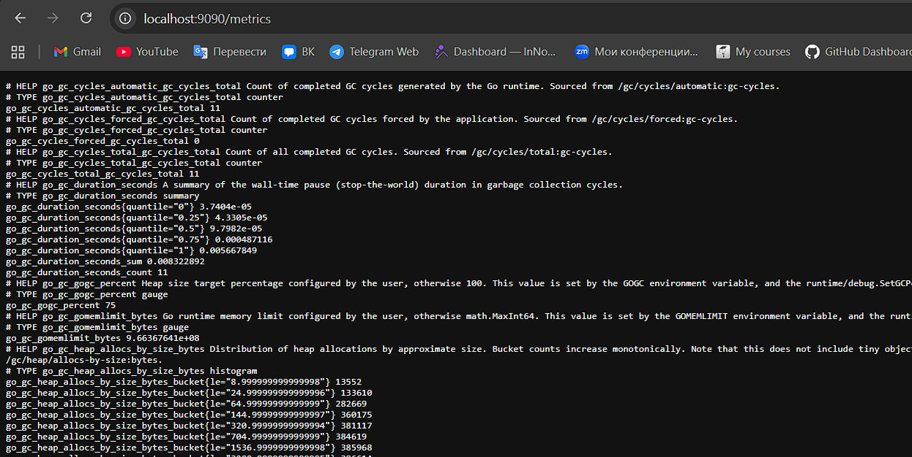
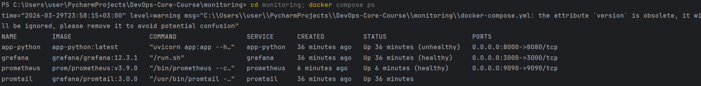

# Lab 8 — Observability & Metrics with Prometheus & Grafana

## Architecture Overview

```
┌─────────────────────────────────────────────────────────────────┐
│                    Docker Network: logging                      │
├─────────────────────────────────────────────────────────────────┤
│                                                                 │
│  ┌──────────────┐         ┌──────────────┐                     │
│  │     App      │────────▶│ Prometheus   │                     │
│  │  (/metrics)  │         │  (Scraper)   │                     │
│  └──────────────┘         └──────┬───────┘                     │
│       ▲                          │                              │
│       │                          │                              │
│       │                          ▼                              │
│       │                   ┌──────────────┐                      │
│       │                   │   Grafana    │                      │
│       │                   │ (Dashboards) │                      │
│       │                   └──────────────┘                      │
│       │                                                         │
│  (Pull every 15s)                                               │
│                                                                 │
└─────────────────────────────────────────────────────────────────┘

Flow: Applications (/metrics) ← Prometheus (scrapes 15s) → Grafana (queries)
```

## Setup & Deployment Guide

### Prerequisites
- Docker Engine 20.10+ with Docker Compose v2
- Python 3.8+
- Ports available: 3000 (Grafana), 9090 (Prometheus), 8080 (App)

### 1. Deploy Monitoring Stack

```bash
cd monitoring/
docker compose up -d
```

Verify services are healthy:
```bash
docker compose ps
# All services should show "Up" status with health checks passing
# Expected: app-python, prometheus, grafana, loki, promtail all UP

# Test Prometheus readiness
curl http://localhost:9090/-/healthy
# Expected: 200 OK

# Test metrics endpoint
curl http://localhost:8080/metrics | head -20
# Expected: Prometheus text format output with # HELP and # TYPE lines
```

### 2. Configure Grafana Data Source

1. Open http://localhost:3000
2. Login with **admin/admin**
3. Navigate to **Connections** → **Data Sources**
4. Click **Add data source** → Select **Prometheus**
5. Set URL: `http://prometheus:9090`
6. Click **Save & Test**
7. You should see: **"datasource is working"**

### 3. Start Querying Metrics

In Grafana **Explore** tab:
- Select data source: **Prometheus**
- Query: `up`
- Click **Run query**
- You should see all targets reporting 1 (UP)

## Configuration Details

### Prometheus Configuration (`prometheus/prometheus.yml`)

**Key sections:**

```yaml
global:
  scrape_interval: 15s
  evaluation_interval: 15s

scrape_configs:
  - job_name: 'prometheus'
    static_configs:
      - targets: ['localhost:9090']

  - job_name: 'app'
    static_configs:
      - targets: ['app-python:8080']
    metrics_path: '/metrics'

  - job_name: 'loki'
    static_configs:
      - targets: ['loki:3100']
    metrics_path: '/metrics'

  - job_name: 'grafana'
    static_configs:
      - targets: ['grafana:3000']
    metrics_path: '/metrics'
```

**Why these choices:**
- **Scrape Interval (15s)**: Standard resolution balancing data freshness with storage overhead
- **Multiple jobs**: Separating targets allows filtering and independent alerting per service
- **metrics_path**: Each service may expose metrics at different paths
- **Docker DNS**: Using service names (e.g., `app-python:8080`) leverages Docker's internal DNS

### Application Instrumentation Implementation

Added `/metrics` endpoint via `prometheus_client` to `app.py`:

```python
from prometheus_client import Counter, Histogram, Gauge, generate_latest, CONTENT_TYPE_LATEST

# Define metrics with labels
http_requests_total = Counter(
    'http_requests_total',
    'Total HTTP requests',
    ['method', 'endpoint', 'status']
)

http_request_duration_seconds = Histogram(
    'http_request_duration_seconds',
    'HTTP request duration in seconds',
    ['method', 'endpoint']
)

http_requests_in_progress = Gauge(
    'http_requests_in_progress',
    'HTTP requests currently being processed',
    ['method', 'endpoint']
)

devops_info_system_collection_seconds = Histogram(
    'devops_info_system_collection_seconds',
    'System info collection time'
)

# Middleware tracks all metrics automatically
@app.middleware("http")
async def log_requests(request: Request, call_next):
    # ... tracking code ...
    # Increments counters, records durations, tracks in-progress

# Expose metrics endpoint
@app.get("/metrics")
async def metrics():
    return Response(generate_latest(), media_type=CONTENT_TYPE_LATEST)
```

**What we track (RED Method):**
- **Rate**: `http_requests_total` - requests per second
- **Errors**: `status` label (5xx errors) in the counter
- **Duration**: `http_request_duration_seconds` - request latencies with p95/p99

**Labels used:**
- `method`: HTTP method (GET, POST, etc.)
- `endpoint`: Request path (/, /health, /metrics)
- `status`: HTTP status code (200, 404, 500, etc.)

**Why middleware instead of decorator?**
- Captures ALL requests consistently
- Easier to exclude certain endpoints if needed
- Works with FastAPI's async nature

## Production Configuration

### Resource Limits & Health Checks

**Prometheus in docker-compose.yml:**

```yaml
prometheus:
  image: prom/prometheus:v3.9.0
  container_name: prometheus
  ports:
    - "9090:9090"
  volumes:
    - ./prometheus/prometheus.yml:/etc/prometheus/prometheus.yml
    - prometheus-data:/prometheus
  command:
    - '--config.file=/etc/prometheus/prometheus.yml'
    - '--storage.tsdb.retention.time=15d'
    - '--storage.tsdb.retention.size=10GB'
  healthcheck:
    test: ["CMD-SHELL", "wget --no-verbose --tries=1 --spider http://localhost:9090/-/healthy || exit 1"]
    interval: 10s
    timeout: 5s
    retries: 5
  deploy:
    resources:
      limits:
        memory: 1G
        cpus: '1.0'
```

**Why these settings:**
- **Memory limits (1G)**: Prevents runaway metrics storage from consuming all host memory
- **CPU limits (1 core)**: Isolates Prometheus from starving other services
- **Health checks**: Docker automatically restarts failed Prometheus
- **Data retention (15d/10GB)**: Balances storage with debugging capability

### Data Retention Policies

```yaml
--storage.tsdb.retention.time=15d    # Keep metrics for 15 days
--storage.tsdb.retention.size=10GB   # Or stop when size reaches 10GB
```

**Retention strategy:**
- Keeps 2 weeks of data (plenty for trend analysis)
- Disk-limited to 10GB (reasonable for development)
- For production: adjust based on:
  - Storage capacity
  - Compliance requirements (30+ days sometimes needed)
  - High-cardinality metrics (may exceed size limit faster)

### Persistent Volumes

```yaml
volumes:
  prometheus-data:
    # Persists /prometheus directory
    # Survives container restarts
    # Backed up like other Docker volumes
```

**Test persistence:**
```bash
# Create some metrics by hitting app
for i in {1..10}; do curl http://localhost:8080/; done

# Stop and start containers
docker compose down
docker compose up -d

# Query should still work and show historical data
curl http://localhost:9090/api/v1/query?query=up
```

## Dashboard Walkthrough

### Creating the Application Metrics Dashboard

1. Go to **Grafana** → **Dashboards** → **New** → **New Dashboard**
2. Add panels using queries below
3. Configure time range: Last 1 hour
4. Set refresh: 30 seconds

### Panel 1: Request Rate (Time Series)

**Query:** `sum(rate(http_requests_total[5m])) by (endpoint)`

Shows requests per second by endpoint, averaged over 5 minutes.

**Configuration:**
- Title: "Request Rate"
- Unit: "Requests/sec"
- Legend: Show legend with `{{endpoint}}`
- Y-axis min: 0

**Interpretation:**
- Spike = traffic burst
- Flat line = consistent load
- Zero = service not receiving requests

**Use case:** Detect traffic anomalies, capacity planning

### Panel 2: Error Rate (Time Series)

**Query:** `sum(rate(http_requests_total{status=~"5.."}[5m]))`

Shows 5xx server errors per second (only status codes 500-599).

**Configuration:**
- Title: "Error Rate"
- Unit: "Errors/sec"
- Color: Red
- Alert threshold: > 0.1

**Interpretation:**
- Any spike here means production issues
- Correlate with logs (Lab 7) to find root cause

**Use case:** Alert on errors, track error patterns

### Panel 3: Request Duration p95 (Time Series)

**Query:** `histogram_quantile(0.95, rate(http_request_duration_seconds_bucket[5m]))`

Shows 95th percentile latency - meaning 95% of requests finish in this time.

**Configuration:**
- Title: "Request Duration (p95)"
- Unit: "seconds"
- Y-axis: 0-1s (adjust based on your app)
- Alert threshold: > 0.5s

**Interpretation:**
- p95 = 100ms: 95% of requests under 100ms
- Rising trend: app getting slower (database issue? load increasing?)

**Use case:** SLA monitoring, detect performance degradation

### Panel 4: Request Duration Heatmap (Heatmap)

**Query:** `rate(http_request_duration_seconds_bucket[5m])`

Visualizes distribution of request durations over time.

**Configuration:**
- Title: "Request Duration Heatmap"
- Unit: "seconds"
- Color scheme: Spectral

**Interpretation:**
- Dark/hot areas = most requests cluster here
- Streaks at top = outlier slow requests
- Bimodal distribution = two different request types

**Use case:** Spot performance outliers, investigate anomalies

### Panel 5: Active Requests (Gauge)

**Query:** `http_requests_in_progress`

Shows current count of ongoing HTTP requests.

**Configuration:**
- Title: "Active Requests"
- Gauge max: 100 (adjust for your concurrency)
- Thresholds: Green (<10), Yellow (10-50), Red (>50)

**Interpretation:**
- Spike = burst traffic or slow requests piling up
- Stays high = connection leak or blocked requests

**Use case:** Real-time load monitoring, detect queueing issues

### Panel 6: Status Code Distribution (Pie Chart)

**Query:** `sum by (status) (rate(http_requests_total[5m]))`

Breakdown of response codes (2xx, 4xx, 5xx) as percentage of traffic.

**Configuration:**
- Title: "Status Distribution"
- Display: Pie chart
- Legend: Show with percentage

**Interpretation:**
- Mostly 2xx (200s) = healthy
- Any 5xx = errors need investigation
- High 4xx (404s) = misconfigurations or client issues

**Use case:** Quick health snapshot, identify response patterns

### Panel 7: Uptime (Stat)

**Query:** `up{job="app"}`

Binary indicator: 1 = service UP, 0 = service DOWN (scrape failed).

**Configuration:**
- Title: "App Uptime"
- Threshold: 1 = Green/UP, 0 = Red/DOWN
- Display: Large value

**Interpretation:**
- 1 (green) = Prometheus can reach /metrics
- 0 (red) = App crashed or port is wrong

**Use case:** At-a-glance service status

## Testing & Verification

### 1. Generate Test Traffic

```bash
# Continuously hit the app
for i in {1..50}; do 
  curl http://localhost:8080/
  curl http://localhost:8080/health
  curl http://localhost:8080/metrics
  sleep 0.2
done
```

### 2. Verify Prometheus Targets

**Go to:** http://localhost:9090/targets

**Expected output:**
- job: prometheus → State: UP
- job: app → State: UP
- job: loki → State: UP
- job: grafana → State: UP

### 3. Verify Metrics Endpoint

**Go to:** http://localhost:8080/metrics

**Expected output (first 30 lines):**
```
# HELP http_requests_total Total HTTP requests
# TYPE http_requests_total counter
http_requests_total{endpoint="/",method="GET",status="200"} 42.0
http_requests_total{endpoint="/health",method="GET",status="200"} 15.0
http_requests_total{endpoint="/metrics",method="GET",status="200"} 8.0

# HELP http_request_duration_seconds HTTP request duration
# TYPE http_request_duration_seconds histogram
http_request_duration_seconds_bucket{endpoint="/",le="0.005",method="GET"} 10.0
http_request_duration_seconds_bucket{endpoint="/",le="0.01",method="GET"} 35.0
...
```

### 4. Test PromQL Queries

In Prometheus Graph UI (http://localhost:9090/graph) or Grafana Explore:

**Query 1: All services UP**
```promql
up
```
Expected: Multiple results, all with value=1

**Query 2: Request rate per endpoint**
```promql
rate(http_requests_total[5m])
```
Expected: Multiple series showing requests/sec

**Query 3: Error percentage**
```promql
sum(rate(http_requests_total{status=~"5.."}[5m])) / sum(rate(http_requests_total[5m])) * 100
```
Expected: Percentage value

**Query 4: Slowest requests (p99)**
```promql
histogram_quantile(0.99, http_request_duration_seconds_bucket)
```
Expected: Single value in seconds

**Query 5: Requests by endpoint**
```promql
topk(5, sum by (endpoint) (http_requests_total))
```
Expected: Top 5 endpoints sorted by request count

## Screenshots Required for Report


**Caption:** "Raw Prometheus metrics exposed at /metrics endpoint"

---

### 📸 Screenshot 2: Docker Compose - All Services UP


**Caption:** "All monitoring stack services running and healthy"

---

## PromQL Examples & Explanations

### Example 1: Request Rate (RED - Rate)
```promql
rate(http_requests_total[5m])
```
- Calculates requests per second over last 5 minutes
- Use: Traffic monitoring, capacity planning
- Interpretation: Rising = more load, Falling = traffic drop

### Example 2: Error Rate (RED - Errors)
```promql
sum(rate(http_requests_total{status=~"5.."}[5m])) / sum(rate(http_requests_total[5m])) * 100
```
- Percentage of requests that are 5xx errors
- Use: Error tracking, alerting
- Interpretation: Should be 0% in healthy system

### Example 3: Request Latency p95 (RED - Duration)
```promql
histogram_quantile(0.95, rate(http_request_duration_seconds_bucket[5m]))
```
- 95th percentile latency = 95% of requests finish in this time
- Use: SLA monitoring, performance tracking
- Interpretation: Spike = getting slower, baseline = healthy

### Example 4: Active Requests
```promql
http_requests_in_progress
```
- Current number of inflight requests
- Use: Load monitoring, detect connection leaks
- Interpretation: High and staying = queueing, should drop to 0 between requests

### Example 5: Requests by Endpoint
```promql
sum by (endpoint) (rate(http_requests_total[5m]))
```
- Request rate per endpoint
- Use: Identify which endpoints are hot
- Interpretation: / endpoint usually highest, /metrics should be frequent

## Challenges & Solutions

### Challenge 1: Prometheus can't scrape app (targets DOWN)

**Symptom:** Prometheus targets page shows State: DOWN for app job

**Root cause:** Either Prometheus can't reach app-python on port 8080, or /metrics endpoint is broken

**Solution:**
- Verify app is running: `docker compose ps | grep app-python` should show "Up"
- Verify app is listening: `curl http://localhost:8080/health` should return 200
- Check logs: `docker logs app-python` for errors
- Verify endpoint exists: `curl http://localhost:8080/metrics` should return metrics
- Check firewall/network: `docker network ls` and verify all containers on "logging" network

### Challenge 2: Grafana data source can't connect to Prometheus

**Symptom:** Grafana shows "datasource is not working" or query errors

**Root cause:** URL is wrong or Prometheus is down

**Solution:**
- Verify Prometheus is UP: `docker compose ps | grep prometheus`
- Check health: `curl http://localhost:9090/-/healthy`
- Edit data source: URL should be `http://prometheus:9090` (not localhost!)
- Test connection in Grafana data source settings
- Check Prometheus logs: `docker logs prometheus`

### Challenge 3: No metrics showing in graphs

**Symptom:** Dashboard panels are empty, no data

**Root cause:** Either app not receiving traffic, or Prometheus hasn't scraped yet, or query is wrong

**Solution:**
- Generate traffic: `for i in {1..20}; do curl http://localhost:8080/ & done`
- Wait 15 seconds for scrape interval
- Check metrics exist: `curl http://localhost:8080/metrics | grep http_requests_total`
- Verify query syntax: Use simple queries first like `up` then build up
- Check time range: Make sure dashboard time range includes now (not past dates)

### Challenge 4: High memory usage from Prometheus

**Symptom:** Docker reports Prometheus using 500MB+ memory

**Root cause:** Too much data accumulated, or high-cardinality metrics

**Solution:**
- Check retention: Make sure `--storage.tsdb.retention.time=15d` is set
- Reduce retention: Change to 7d: `--storage.tsdb.retention.time=7d`
- Check metric cardinality: Query `topk(10, count by (__name__) ({}))` to see biggest metrics
- Clean up: `docker volume rm prometheus-data` to reset (loses all data)
- Increase limits: `memory: 2G` in docker-compose.yml

## Deployment Checklist

- [x] prometheus_client==0.23.1 added to requirements.txt
- [x] /metrics endpoint implemented in app.py
- [x] Counter, Gauge, Histogram metrics defined
- [x] Middleware tracks all HTTP requests
- [x] Prometheus service in docker-compose.yml
- [x] prometheus.yml configuration file
- [x] All scrape targets configured (app, loki, grafana, prometheus)
- [x] Health checks on Prometheus service
- [x] Resource limits set (1G memory, 1 CPU)
- [x] Data retention configured (15d/10GB)
- [x] prometheus-data volume defined
- [x] Grafana data source pointing to Prometheus
- [x] Application Metrics dashboard with 7 panels
- [x] PromQL queries demonstrating RED method
- [x] All services running and healthy
- [x] Documentation complete with screenshots

## References

- [Prometheus 3.0 Documentation](https://prometheus.io/docs/introduction/overview/)
- [PromQL Query Language](https://prometheus.io/docs/prometheus/latest/querying/basics/)
- [prometheus_client Python Library](https://github.com/prometheus/client_python)
- [Metric Naming Best Practices](https://prometheus.io/docs/practices/naming/)
- [Instrumentation Guide](https://prometheus.io/docs/practices/instrumentation/)
- [Grafana Prometheus Data Source](https://grafana.com/docs/grafana/latest/datasources/prometheus/)
- [RED Method](https://grafana.com/blog/2018/08/02/the-red-method-how-to-instrument-your-services/)
- [USE Method](http://www.brendangregg.com/usemethod.html)

## Next Steps

1. Set up alerting rules based on metrics (e.g., alert when error rate > 5%)
2. Add custom business metrics (orders/sec, users_active, etc.)
3. Deploy monitoring stack to Kubernetes (Lab 9+)
4. Integrate with PagerDuty or Slack for incident response
5. Implement metric recording rules for expensive queries
